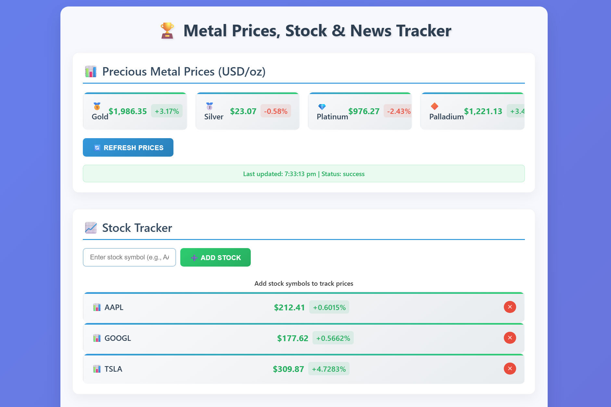
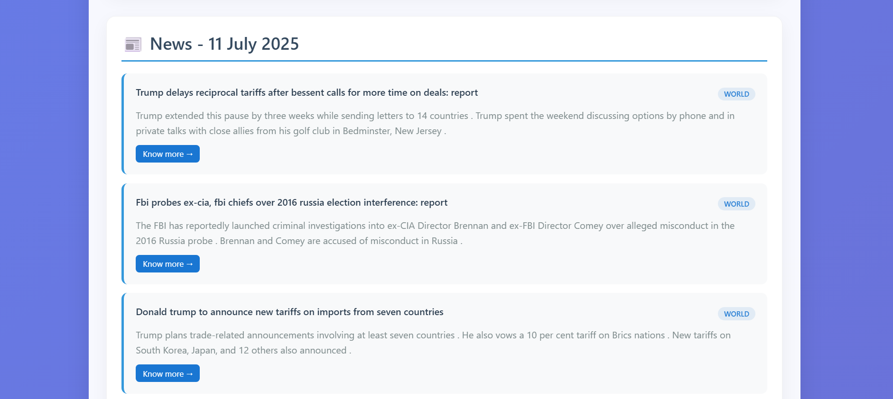

# 🏆 Metal Prices, Stock & News Tracker

A sleek, responsive web app that lets users:
- 🪙 Track real-time **precious metal prices** (Gold, Silver, Platinum, Palladium)
- 📈 Monitor live **stock market prices** using stock symbols (via Alpha Vantage)
- 📰 View daily curated **financial news**

This is a perfect tool for investors, traders, and finance enthusiasts to stay informed.

---

## 🚀 Features

- 💰 Live updates for Gold, Silver, Platinum & Palladium (in USD/oz)
- 🧠 Smart tracking for multiple stock symbols
- 🔔 Real-time price change indicators
- 🗞️ Financial news with summaries and source links

---

## 🔧 Setup Instructions

1. **Clone this repo**
   git clone https://github.com/your-username/metal-stock-news-tracker.git
   
   cd metal-stock-news-tracker

2. **Install Python dependencies**
    pip install -r requirements.txt

3. **Add your API keys**
    1.Create a conjig.js file with contents:
    const CONFIG = {
    ALPHA_VANTAGE_API_KEY: "Your_alpha_vantage_API_KEY",
    METALS_API_KEY: "Your_Metals_API_KEY"  
    };

    2.Create a .env file with:
    EMAIL_USER=your_email@gmail.com
    EMAIL_PASS=your_app_password

    Note: The password is not same as your Gmail password
            Enable 2-Step Verification on your Google account:
            https://myaccount.google.com/security
            Generate an App Password here:
            https://myaccount.google.com/apppasswords
    
    3. Give the list of gmail of receivers as a string  in the email_sender.py file

4. **Usage Instructions**
    Run the following files in order every day or automate it (using task scheduler in windows / cron jobs in mac or linux)
    1.Move inside the scrappyfile directory
    2.Run this command in terminal : scrapy crawl news_spider
    3.Run email_sender.py to send email to the list of receivers -- To send email
    4.Run dashboard_newsfeeder.py to feed news to the html file -- To view dashboard

5. **View your personalised dashboard**
    Your dashboard will be ready to be viewed!

This project is licensed under the Apache-2.0 License.

Vikashh Adaikalavan K

Gmail: vikashhadaikalavan@gmail.com

